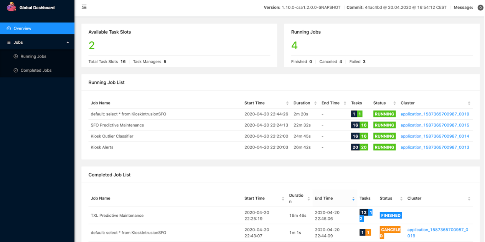

# Run a Recipe on a Flink Cluster on AWS EKS

[pangeo-forge-runner](https://github.com/pangeo-forge/pangeo-forge-runner) supports baking your recipes on Apache Flink using
the [Apache Flink Runner](https://beam.apache.org/documentation/runners/flink/)
for Beam. After looking at various options, we have settled on supporting
Flink on Kubernetes using Apache's [Flink Operator](https://nightlies.apache.org/flink/flink-kubernetes-operator-docs-main/).
This allows us to bake recipes on *any* Kubernetes cluster! In this tutorial, we'll bake a recipe that we use 
for [integration tests](https://github.com/pangeo-forge/pangeo-forge-runner/tree/main/tests/integration) on 
an Amazon [EKS](https://aws.amazon.com/eks/) k8s cluster!

Current support:

| **pangeo-forge-recipes version** | **pangeo-forge-runner version** | **flink k8s operator version** | **flink version** |                  **apache-beam version**                 |
|:--------------------------------:|:----------------------------:|:--------------------------------:|:--------------------:|:--------------------------------------------------------------:|
| \>\=0.10.0 | \>\=0.9.1 | 1.6.1                           | 1.16                | >=2.47.0<br>(all versions listed [here](https://repo.maven.apache.org/maven2/org/apache/beam/beam-runners-flink-1.16/)) |


## Setting up EKS

You need an EKS cluster with [Apache Flink Operator](https://nightlies.apache.org/flink/flink-kubernetes-operator-docs-main/)
installed. Setting that up is out of the scope for this tutorial, but you can find some
Terraform for that [here](https://github.com/pangeo-forge/pangeo-forge-cloud-federation).

## Setting up your Local Machine as a Runner 

1. Install required tools on your machine.
   1. [awscli](https://docs.aws.amazon.com/cli/latest/userguide/getting-started-install.html)
   2. [kubectl>=1.25](https://kubernetes.io/docs/tasks/tools/#kubectl), see [Install and Set Up kubectl on Linux on kubernetes.io](https://kubernetes.io/docs/tasks/tools/install-kubectl-linux/) or [Installing or updating kubectl on docs.aws.amazon.com](https://docs.aws.amazon.com/eks/latest/userguide/install-kubectl.html)
   3. [pangeo-forge-runner>=0.9.1](https://pypi.org/project/pangeo-forge-runner/)


2. If you don't already have AWS Access/Secret keys you will need to [create them](https://docs.aws.amazon.com/IAM/latest/UserGuide/id_credentials_access-keys.html#Using_CreateAccessKey). 
Then set up your credentials locally so awscli can pick them up using the [configure command](https://docs.aws.amazon.com/cli/latest/userguide/cli-chap-configure.html).


3. Ask your administrator to add your IAM user arn to the correct k8s `aws-auth` configuration. Then the admin will 
ask you to run a command to get EKS credentials locally that might look like this:

   ```zsh
   $ AWS_PROFILE=<your-aws-profile> aws eks update-kubeconfig --name <cluster-name> --region <aws-cluster-region>
   ```

4. Verify everything is working by running the following command:

   ```zsh
   $ kubectl -n default get flinkdeployment,deploy,pod,svc
   ```

5. You should see the default k8s resource such as the `flink-kubernetes-operator` similar to what's below:

   ```zsh
   NAME                                        READY   UP-TO-DATE   AVAILABLE   AGE
   deployment.apps/flink-kubernetes-operator   1/1     1            1           15d

   NAME                                             READY   STATUS    RESTARTS        AGE
   pod/flink-kubernetes-operator-559fccd895-pfdwj   2/2     Running   2 (2d21h ago)   6d17h

   NAME                                     TYPE        CLUSTER-IP       EXTERNAL-IP   PORT(S)             AGE
   service/flink-operator-webhook-service   ClusterIP   10.100.231.230   <none>        443/TCP             20d
   service/kubernetes                       ClusterIP   10.100.0.1       <none>        443/TCP             20d
   ```

## Setting up Runner Configuration

Let's first look at defining *where* the data that our recipes will use is stored. There are three aspects of this question
we must answer: 

1. where data is discovered/read from

2. where data is cached to, and 

3. where data is output to

### Where Data is Discovered

Recipe input is defined in the recipe itself. Most recipes will define a `pangeo_forge_recipes.patterns.FilePattern` that provides the pipeline with input file locations.
The example below taken from [this example recipe](https://github.com/pforgetest/gpcp-from-gcs-feedstock/blob/main/feedstock/recipe.py)

   ```python
   import apache_beam as beam
   import pandas as pd

   from pangeo_forge_recipes.patterns import ConcatDim, FilePattern
   from pangeo_forge_recipes.transforms import OpenURLWithFSSpec, OpenWithXarray, StoreToZarr
   
   dates = [
       d.to_pydatetime().strftime('%Y%m%d')
       for d in pd.date_range("1996-10-01", "1999-02-01", freq="D")
   ]

   def make_url(time):
       url_base = "https://storage.googleapis.com/pforge-test-data"
       return f"{url_base}/gpcp/v01r03_daily_d{time}.nc"

   concat_dim = ConcatDim("time", dates, nitems_per_file=1)
   pattern = FilePattern(make_url, concat_dim)

   recipe = (
       beam.Create(pattern.items())
       | OpenURLWithFSSpec()
       | OpenWithXarray(file_type=pattern.file_type, xarray_open_kwargs={"decode_coords": "all"})
       | StoreToZarr(
           store_name="gpcp",
           combine_dims=pattern.combine_dim_keys,
       )
   )
   ```

### Where Data is Cached

The inputs and metadata can be cached so items don't have to be resolved again during the next recipe run. Defining where
the caching happens is part of the runner file configuration. More about that in the [next session](#configfiles). Note 
that in those upcoming examples keys `InputCacheStorage`` target these options.

### Where Data is Output

Defining where the data is output is also part of the runner file configuration. More about that in the [next session](#configfiles). Note 
that in those upcoming examples the key `TargetStorage` defines this option.


(configfiles)=
### Configuration Files

Let's build a configuration file for where data is cached and output. It's recommended to configure dataset recipes
using configuration files. A couple of different configuration file formats can be used as seen below.

Notice the use of `{{job_name}}` in the `root_path` configuration examples below.
`{{job_name}}` is special within `root_path` and will be treated as a template-value based on
`Bake.job_name` which can be provided through the CLI or in the configuration file itself and, failing
to be provided, will be generated automatically.

Also notice that we are going to store everything in s3 below because we chose `s3fs.S3FileSystem`. This isn't a requirement.
Pangeo-Forge aims to be storage agnostic. By depending on `fsspec` we're able to plug in supported backends.
Review other well-known `fsspec` [built-in implementations](https://filesystem-spec.readthedocs.io/en/latest/api.html#built-in-implementations)
and `fsspec` [third-party implementations](https://filesystem-spec.readthedocs.io/en/latest/api.html#other-known-implementations).

1. JSON based configuration file:

   ```json
   {
     "TargetStorage": {
       "fsspec_class": "s3fs.S3FileSystem",
       "fsspec_args": {
          "key": "<your-aws-access-key>",
          "secret": "<your-aws-access-secret>",
          "client_kwargs":{"region_name":"<your-aws-bucket-region>"}
        },
       "root_path": "s3://<bucket-name>/<some-prefix>/{{job_name}}/output"
     },
     "InputCacheStorage": {
       "fsspec_class": "s3fs.S3FileSystem",
         "fsspec_args": {
          "key": "<your-aws-access-key>",
          "secret": "<your-aws-access-secret>",
          "client_kwargs":{"region_name":"<your-aws-bucket-region>"}
        },
       "root_path": "s3://<bucket-name>/<some-prefix>/input/cache"
     }
   }
   ```

2. Python based configuration file (configuration is based on the [traitlets library](https://traitlets.readthedocs.io/en/stable/)):

   ```python
   BUCKET_PREFIX = "s3://<bucket-name>/<some-prefix>/"
   # The storage backend we want
   s3_fsspec = "s3fs.S3FileSystem"
   # Credentials for the backend
   s3_args = {
       "key": "<your-aws-access-key>",
       "secret": "<your-aws-access-secret>",
       "client_kwargs":{"region_name":"<your-aws-bucket-region>"}
   }
   # Take note: this is just python. We can reuse these values below

   c.TargetStorage.fsspec_class = s3_fsspec
   # Target output should be partitioned by `{{job_name}}`
   c.TargetStorage.root_path = f"{BUCKET_PREFIX}/{{job_name}}/output"
   c.TargetStorage.fsspec_args = s3_args

   c.InputCacheStorage.fsspec_class = s3_fsspec
   c.InputCacheStorage.fsspec_args = s3_args
   # Input data cache should *not* be partitioned by `{{job_name}}`, as we want to get the datafile from the source only once
   c.InputCacheStorage.root_path = f"{BUCKET_PREFIX}/cache/input"
   ```


### Other Configuration Options

A [subset of the configuration schema](https://github.com/pangeo-forge/pangeo-forge-recipes/blob/main/pangeo_forge_recipes/injections.py) 
that we just talked about related to inputs/outputs/caches gets dependency injected into the recipe by the runner. 

Various other runner options ([documented here](https://pangeo-forge-runner.readthedocs.io/en/latest/reference/index.html) and [flink-specific here](https://nightlies.apache.org/flink/flink-docs-release-1.16/docs/deployment/config/)) 
can also be passed either in the file configuration format above or directly during CLI `bake` calls. It's recommended that you use
the file configuration because some argument values are JSON based.

Here's a quick example of a configuration file and `bake` command slightly more complicated where you're passing [flink-specific configuration options](https://nightlies.apache.org/flink/flink-docs-release-1.16/docs/deployment/config/) and runner options. 
Note that `-f <path-to-your-runner-config>.<json||py>` would point to the runner configuration file talked about above:

   ```python
   BUCKET_PREFIX = "s3://<bucket-name>/<some-prefix>/"
   # The storage backend we want
   s3_fsspec = "s3fs.S3FileSystem"
   # Credentials for the backend
   s3_args = {
       "key": "<your-aws-access-key>",
       "secret": "<your-aws-access-secret>",
       "client_kwargs":{"region_name":"<your-aws-bucket-region>"}
   }
   # Take note: this is just python. We can reuse these values below
   c.FlinkOperatorBakery.job_manager_resources = {"memory": "2048m", "cpu": 1.0}
   c.FlinkOperatorBakery.task_manager_resources = {"memory": "2048m", "cpu": 1.0}
   c.FlinkOperatorBakery.flink_configuration= {
      "taskmanager.numberOfTaskSlots": "1", 
      "taskmanager.memory.flink.size": "1536m", 
      "taskmanager.memory.task.off-heap.size": "256m", 
      "taskmanager.memory.jvm-overhead.max": "1024m"
   }
   c.FlinkOperatorBakery.parallelism = 1
   c.FlinkOperatorBakery.flink_version = "1.16"
   # NOTE: image name must match the version of python and apache-beam being used locally
   c.Bake.container_image = 'apache/beam_python3.9_sdk:2.50.0'
   c.Bake.bakery_class = "pangeo_forge_runner.bakery.flink.FlinkOperatorBakery"

   c.TargetStorage.fsspec_class = s3_fsspec
   # Target output should be partitioned by `{{job_name}}`
   c.TargetStorage.root_path = f"{BUCKET_PREFIX}/{{job_name}}/output"
   c.TargetStorage.fsspec_args = s3_args

   c.InputCacheStorage.fsspec_class = s3_fsspec
   c.InputCacheStorage.fsspec_args = s3_args
   # Input data cache should *not* be partitioned by `{{job_name}}`, as we want to get the datafile from the source only once
   c.InputCacheStorage.root_path = f"{BUCKET_PREFIX}/cache/input"
   ```

   ```bash
   pangeo-forge-runner bake \
       --repo="https://github.com/pforgetest/gpcp-from-gcs-feedstock.git"  \
       --ref="0.10.3" \
       -f <path-to-your-runner-config>.<json||py> \
       --Bake.job_name=recipe \
       --prune
   ```

Where you put things is your choice but _please be careful_: you don't want to commit AWS secrets into GH!

## Running the Recipe

Now let's run the [integration test recipe](https://github.com/pforgetest/gpcp-from-gcs-feedstock.git)!
Below is the minimal required configuration args for running something successful for Flink on `pangeo-forge-runner>=0.9.1`
where `<path-to-your-runner-config>.<json||py>` is your configuration file talked about above:

   ```python
   BUCKET_PREFIX = "s3://<bucket-name>/<some-prefix>/"
   # The storage backend we want
   s3_fsspec = "s3fs.S3FileSystem"
   # Credentials for the backend
   s3_args = {
       "key": "<your-aws-access-key>",
       "secret": "<your-aws-access-secret>",
       "client_kwargs":{"region_name":"<your-aws-bucket-region>"}
   }
   # Take note: this is just python. We can reuse these values below
   c.FlinkOperatorBakery.flink_configuration= {
      "taskmanager.numberOfTaskSlots": "1", 
   }
   c.FlinkOperatorBakery.parallelism = 1
   c.FlinkOperatorBakery.flink_version = "1.16"
   # NOTE: image name must match the version of python and apache-beam being used locally
   c.Bake.container_image = 'apache/beam_python3.9_sdk:2.50.0'
   c.Bake.bakery_class = "pangeo_forge_runner.bakery.flink.FlinkOperatorBakery"

   c.TargetStorage.fsspec_class = s3_fsspec
   # Target output should be partitioned by `{{job_name}}`
   c.TargetStorage.root_path = f"{BUCKET_PREFIX}/{{job_name}}/output"
   c.TargetStorage.fsspec_args = s3_args

   c.InputCacheStorage.fsspec_class = s3_fsspec
   c.InputCacheStorage.fsspec_args = s3_args
   # Input data cache should *not* be partitioned by `{{job_name}}`, as we want to get the datafile from the source only once
   c.InputCacheStorage.root_path = f"{BUCKET_PREFIX}/cache/input"
   ```

   ```bash
   pangeo-forge-runner bake \
       --repo=https://github.com/pforgetest/gpcp-from-gcs-feedstock.git  \
       --ref="0.10.3" \
       -f <path-to-your-runner-config>.<json||py> \
       --Bake.job_name=recipe \
       --prune
   ```

Note that `Bake.prune=True` onlys tests the recipe by running the first two time steps like the integration tests do.

## Monitoring Job Output via the Flink Dashboard 

After you run the `pangeo-forge-runner` command, among the many lines of output,
you should see something that looks like:

`You can run 'kubectl port-forward --pod-running-timeout=2m0s --address 127.0.0.1 <some-name> 0:8081' to make the Flink Dashboard available!`

If you copy the command provided in the message and run it, it should provide you
with a local address where the Flink Job Manager Dashboard will be available!

```
$ kubectl port-forward --pod-running-timeout=2m0s --address 127.0.0.1 <some-name> 0:8081
Forwarding from 127.0.0.1:<some-number> -> 8081
```

Copy the `127.0.0.1:<some-number>` URL to your browser, and tada! Now you can watch our job and tasks remotely



## Monitoring Job Output via k8s Logs

There are other ways to understand when your jobs/tasks have completed by querying the k8s logs. 
The job manager will include any tracebacks from your task managers and will also include the most reasonable 
output about whether things succeeded

First, list out your pods and find your job manager pod as noted below:

   ```bash
   $ kubectl -n default get pod
   ```

Then grok the output and pay attention to these notes:

   ```bash
   NAME                                             READY   STATUS    RESTARTS       AGE
   pod/flink-kubernetes-operator-559fccd895-pfdwj   2/2     Running   2 (3d1h ago)   6d21h
   
   # NOTE: the job manager here gets provisioned as `<Bake.job_name>-<k8s-resource-hash>`
   # so `Bake.job_name="nz-5ftesting"` in this case
   pod/nz-5ftesting-66d8644f49-wnndr                1/1     Running   0              55m
   
   # NOTE: the task managers always have a similar suffix depending on your 
   # `--FlinkOperatorBakery.parallelism` setting. Here it was set to `--FlinkOperatorBakery.parallelism=2`
   pod/nz-5ftesting-task-manager-1-1                1/1     Running   0              55m
   pod/nz-5ftesting-task-manager-1-2                1/1     Running   0              55m
   ```

Dumping the job manager logs and grepping for this line will signal a success or failure of overall job:

   ```bash
   $ kubectl -n default logs pod/nz-5ftesting-66d8644f49-wnndr | grep 'Job BeamApp-flink-.*RUNNING to.*'
   ```

   ```bash
   # which might show this in a fail case:
   2023-11-06 17:46:20,299 INFO  org.apache.flink.runtime.executiongraph.ExecutionGraph 
   [] - Job BeamApp-flink-1106174115-5000126 (d4a75ed1adf735f89649113c82b4f45a) switched from state RUNNING to FAILING.
   
   # or this in a successful case
   2023-11-06 17:46:20,299 INFO  org.apache.flink.runtime.executiongraph.ExecutionGraph 
   [] - Job BeamApp-flink-1106174115-5000126 (d4a75ed1adf735f89649113c82b4f45a) switched from state RUNNING to COMPLETED.
   ```

## Flink Memory Allocation Tricks and Trapdoors

Sometimes you'll have jobs fail on Flink with errors about not enough `off-heap` memory or the JVM being OOM killed. Here
are some configuration options to think about when running jobs.

The `kind: FlinkDeployment` resource has a goal which is to spin up a job manager. The job manager has a goal which is
to spin up the task managers (depending on your `--FlinkOperatorBakery.parallelism` setting). In k8s land
you can get a sense for which deployment/pod is which by considering your `--Bake.job_name`:

First run this command:

   ```bash
   $ kubectl -n default get pod
   ```

Then consider this output:

   ```bash
   NAME                                             READY   STATUS    RESTARTS       AGE
   pod/flink-kubernetes-operator-559fccd895-pfdwj   2/2     Running   2 (3d1h ago)   6d21h
   
   # NOTE: the job manager here gets provisioned as `<Bake.job_name>-<k8s-resource-hash>`
   pod/nz-5ftesting-66d8644f49-wnndr                1/1     Running   0              55m
   
   # NOTE: the task managers always have a similar suffix depending on your 
   # `--FlinkOperatorBakery.parallelism` setting. Here it was set to `--FlinkOperatorBakery.parallelism=2`
   pod/nz-5ftesting-task-manager-1-1                1/1     Running   0              55m
   pod/nz-5ftesting-task-manager-1-2                1/1     Running   0              55m
   ```

If we grok the first ten lines of the job manager logs we get a nice ascii breakdown of the job manager resourcing that 
corresponds to the matching [Flink memory configurations](https://nightlies.apache.org/flink/flink-docs-release-1.16/docs/deployment/config/#memory-configuration). 

Run this command:

   ```bash
   $ kubectl logs pod/nz-5ftesting-66d8644f49-wnndr | grep -a6 "Final Master Memory configuration:"
   ````

Consider this output:

   ```bash
   INFO  [] - Loading configuration property: jobmanager.memory.process.size, 6144m
   INFO  [] - Loading configuration property: taskmanager.rpc.port, 6122
   INFO  [] - Loading configuration property: internal.cluster.execution-mode, NORMAL
   INFO  [] - Loading configuration property: kubernetes.jobmanager.cpu, 1.0
   INFO  [] - Loading configuration property: prometheus.io/scrape, true
   INFO  [] - Loading configuration property: $internal.flink.version, v1_16
   INFO  [] - Final Master Memory configuration:

   # set via: `--FlinkOperatorBakery.job_manager_resources='{"memory": "<size>m", "cpu": <float>}'`
   # corresponds to: https://nightlies.apache.org/flink/flink-docs-release-1.16/docs/deployment/config/#jobmanager.memory.process.size

   INFO  [] -   Total Process Memory: 6.000gb (6442450944 bytes)

   # set via: `-FlinkOperatorBakery.flink_configuration='{"taskmanager.memory.flink.size": "<size>m"}'`
   # corresponds to: https://nightlies.apache.org/flink/flink-docs-release-1.16/docs/deployment/config/#jobmanager-memory-flink-size
   INFO  [] -     Total Flink Memory: 5.150gb (5529770384 bytes)
   INFO  [] -       JVM Heap:         5.025gb (5395552656 bytes)
   INFO  [] -       Off-heap:         128.000mb (134217728 bytes)
   INFO  [] -     JVM Metaspace:      256.000mb (268435456 bytes)
   INFO  [] -     JVM Overhead:       614.400mb (644245104 bytes)
   ```

While the task manager doesn't have this nice memory configuration breakdown, the 
[Flink memory configurations](https://nightlies.apache.org/flink/flink-docs-release-1.16/docs/deployment/config/#memory-configuration)
have all the same options for the task managers.

These settings are probably recipe specific b/c it depends what you are doing. A good default is to set the 
job/task manager process memory higher than needed and hope that the fractional allocations talked in the 
[Flink memory configuration](https://nightlies.apache.org/flink/flink-docs-release-1.16/docs/deployment/config/#memory-configuration) 
will carve off enough room to do their job. 

Then only adjust if you are getting specific errors about memory. The one caveat here is that `taskmanager.memory.flink.size` 
can't have a fractional allocation of total process memory and so it's best to set it outright at or below your total process memory:

   ```bash
   pangeo-forge-runner bake \
        --repo=https://github.com/pforgetest/gpcp-from-gcs-feedstock.git  \
       --ref="0.10.3" \
       -f <path-to-your-runner-config>.<json||py> \
       
        # corresponds to: https://nightlies.apache.org/flink/flink-docs-release-1.16/docs/deployment/config/#jobmanager.memory.process.size
       --FlinkOperatorBakery.job_manager_resources='{"memory": "2048m", "cpu": 0.3}' \
       
        # corresponds to: https://nightlies.apache.org/flink/flink-docs-release-1.16/docs/deployment/config/#taskmemory.memory.process.size
       --FlinkOperatorBakery.task_manager_resources='{"memory": "2048m", "cpu": 0.3}' \
       
        # corresponds to any options from: https://nightlies.apache.org/flink/flink-docs-release-1.16/docs/deployment/config/
       --FlinkOperatorBakery.flink_configuration='{"taskmanager.numberOfTaskSlots": "1", "taskmanager.memory.flink.size": "1536m"}' \
       
        # corresponds to: https://nightlies.apache.org/flink/flink-docs-release-1.16/docs/deployment/config/#pipeline-max-parallelism
       --FlinkOperatorBakery.parallelism=1 \
       --FlinkOperatorBakery.flink_version="1.16" \
       --Bake.prune=True \
       --Bake.job_name=recipe \
       
       # corresponds: https://nightlies.apache.org/flink/flink-docs-release-1.16/docs/deployment/config/#kubernetes-container-image
       --Bake.container_image='apache/beam_python3.9_sdk:2.50.0' \
       --Bake.bakery_class="pangeo_forge_runner.bakery.flink.FlinkOperatorBakery"
   ```
